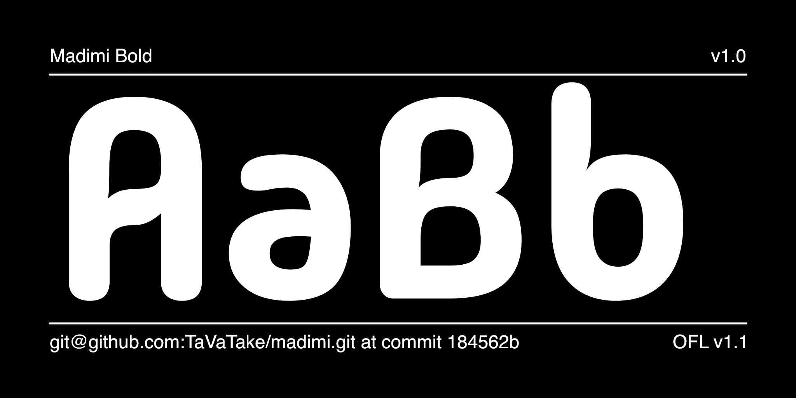
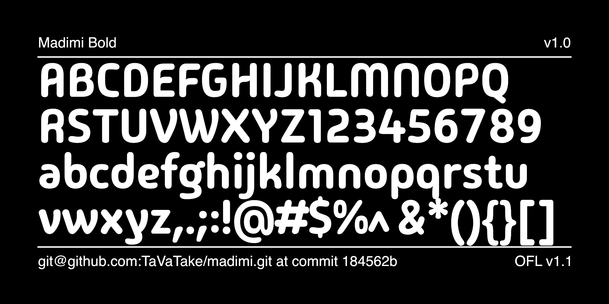

# Madimi

[![][Fontbakery]](https://TaVaTake.github.io/madimi/fontbakery/fontbakery-report.html)
[![][Universal]](https://TaVaTake.github.io/madimi/fontbakery/fontbakery-report.html)
[![][GF Profile]](https://TaVaTake.github.io/madimi/fontbakery/fontbakery-report.html)
[![][Outline Correctness]](https://TaVaTake.github.io/madimi/fontbakery/fontbakery-report.html)
[![][Shaping]](https://TaVaTake.github.io/madimi/fontbakery/fontbakery-report.html)

[Fontbakery]: https://img.shields.io/endpoint?url=https%3A%2F%2Fraw.githubusercontent.com%2FTaVaTake%2Fmadimi%2Fgh-pages%2Fbadges%2Foverall.json
[GF Profile]: https://img.shields.io/endpoint?url=https%3A%2F%2Fraw.githubusercontent.com%2FTaVaTake%2Fmadimi%2Fgh-pages%2Fbadges%2FGoogleFonts.json
[Outline Correctness]: https://img.shields.io/endpoint?url=https%3A%2F%2Fraw.githubusercontent.com%2FTaVaTake%2Fmadimi%2Fgh-pages%2Fbadges%2FOutlineCorrectnessChecks.json
[Shaping]: https://img.shields.io/endpoint?url=https%3A%2F%2Fraw.githubusercontent.com%2FTaVaTake%2Fmadimi%2Fgh-pages%2Fbadges%2FShapingChecks.json
[Universal]: https://img.shields.io/endpoint?url=https%3A%2F%2Fraw.githubusercontent.com%2FTaVaTake%2Fmadimi%2Fgh-pages%2Fbadges%2FUniversal.json

Madimi is a rounded sans with a mixed geometric and organic design. 	The design covers all of Google Latin Core. Madimi takes inspiration from the gentle curved geometry of certain Southern Afrikan graphic symbols. Circles are a main feature, the circle being a shape that represents the womb of a woman in KiNtu symbologies. The idea behind Madimi is to enact the  subtle visual subtext of Afrikan visual traditions. Madimi is simple, clean and round edged but still remains clear and easy to read.

## About

Taurai Valerie Mtake is a Type Designer, and Graphic Designer from Harare, Zimbabwe. Currently based in Stockholm, Sweden. Taurai designed Madimi with mentoring and technical help from Laura Meseguer, Lisa Huang, and Mirko Velimirovic. 

## Building

Fonts are built automatically by GitHub Actions - take a look in the "Actions" tab for the latest build.

If you want to build fonts manually on your own computer:

* `make build` will produce font files.
* `make test` will run [FontBakery](https://github.com/googlefonts/fontbakery)'s quality assurance tests.
* `make proof` will generate HTML proof files.

The proof files and QA tests are also available automatically via GitHub Actions - look at https://TaVaTake.github.io/madimi.

## Changelog

When you update your font (new version or new release), please report all notable changes here, with a date.
[Font Versioning](https://github.com/googlefonts/gf-docs/tree/main/Spec#font-versioning) is based on semver. 
Changelog example:

**26 May 2021. Version 2.13**
- MAJOR Font turned to a variable font.
- SIGNIFICANT New Stylistic sets added.

## License

This Font Software is licensed under the SIL Open Font License, Version 1.1.
This license is available with a FAQ at
https://scripts.sil.org/OFL

## Repository Layout

This font repository structure is inspired by [Unified Font Repository v0.3](https://github.com/unified-font-repository/Unified-Font-Repository), modified for the Google Fonts workflow.
